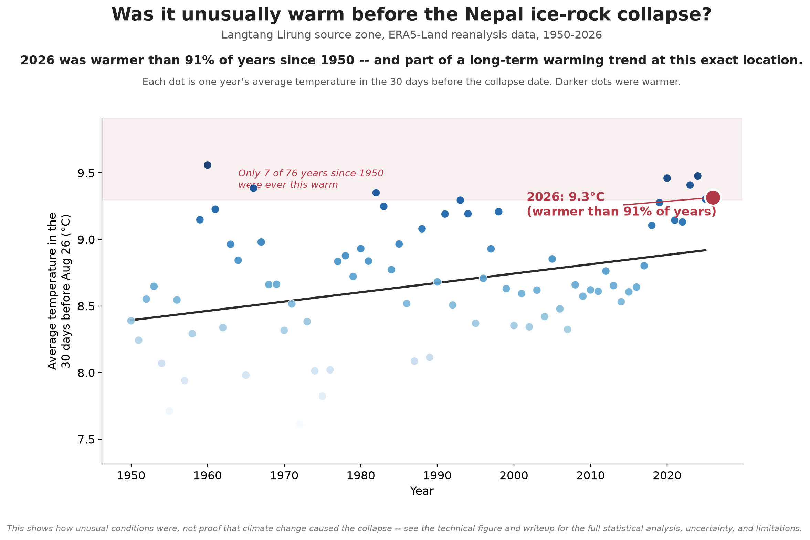
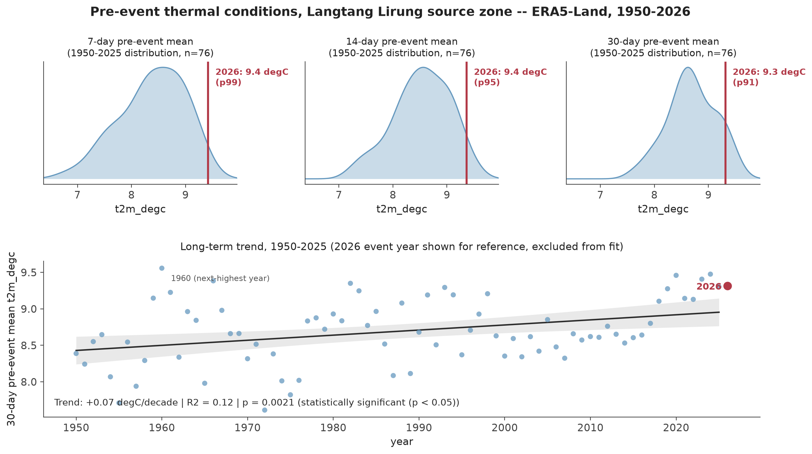
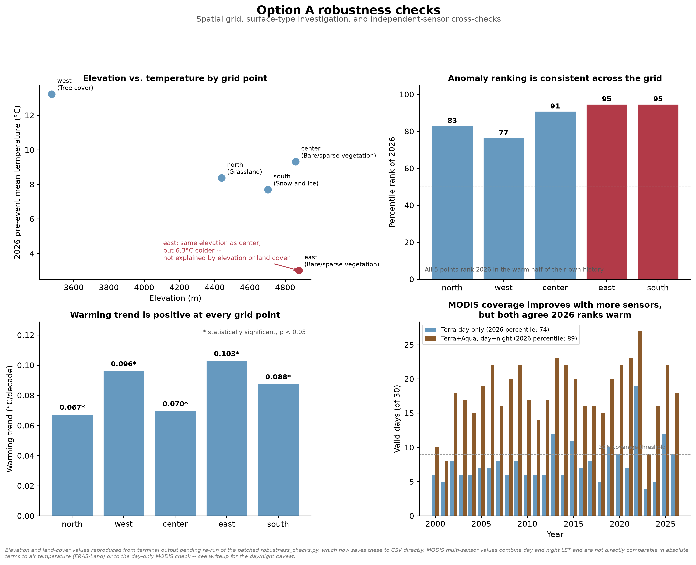
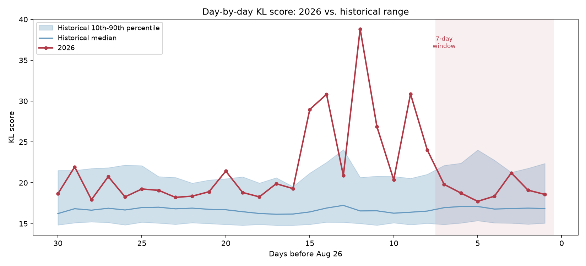

# Nepal Ice-Rock Collapse: Climate Screening


## Background

On August 26, 2026, an ice-rock avalanche collapsed from the north face of Langtang Lirung on the Nepal-Tibet border, triggering a flood down the Lehende Khola that killed hundreds of people. This project asks a narrow question about it: were the thermal conditions in the weeks before the collapse unusual for this exact location, and does that fit the region's longer-term warming trend?

It is not a climate attribution study. There is no probability ratio claim here and no claim that climate change caused this collapse. That kind of formal detection and attribution work needs a full counterfactual ensemble, which is a research group scale undertaking. What's here is smaller and more honest about its limits: a screening analysis, done two structurally different ways, that tells you how unusual things looked and whether that fits a real trend.



## Method

### Method A: trend-based screening

Classical statistics on ERA5-Land reanalysis at the exact site coordinates: percentile rank of the pre-event window against 76 years of history, plus a Mann-Kendall/Theil-Sen trend (chosen over ordinary least squares after OLS residuals showed autocorrelation that would have overstated the trend's significance). Checked for spatial robustness across a five-point grid, cross-checked against an independent satellite sensor (MODIS land surface temperature), and grounded against the published High Mountain Asia warming literature.

| Window | Percentile rank vs. 1950-2025 |
|---|---|
| 7 days before | 99th |
| 14 days before | 95th |
| 30 days before | 91st |





### Method B: VAE-based anomaly detection

A convolutional variational autoencoder trained on 76 years of ERA5-Land temperature fields over the ~220 km region around the site, learning what a normal pre-event spatial pattern looks like. Reconstruction error and KL divergence were both tested as anomaly signals rather than assuming the standard one (reconstruction error) would be the useful one. It wasn't. KL divergence turned out to discriminate synthetic anomalies two to three times better, so that's the primary signal used here.

| Window | Percentile rank vs. 1950-2025 (KL score) |
|---|---|
| 7 days before | 71st |
| 14 days before | 96th |
| 30 days before | 97th |

The 14 and 30 day results line up closely with Method A. The 7-day figure doesn't, and that mismatch turned out to be worth following up rather than a nuisance to explain away.



SHAP was used to check what the model's KL score was actually responding to, and a raw field comparison against climatology was run independently of the model entirely. Both agreed: the final week's warmth was genuinely region-wide, not concentrated at the site, and the sharpest signal in the whole 30-day window sits well before the final week, which is why the two methods read the last 7 days differently.

## Key finding

The month before the collapse was warmer than about 90% of years since 1950 at this site, and that sits on top of a real, if modest, long-term warming trend (+0.07°C per decade, Mann-Kendall p = 0.0043). Six years since 1950 were warmer, so this wasn't a record, just clearly in the warm tail.

Digging into the last week specifically turned up something more interesting than a clean number. A point-based statistical method and a deep learning model looking at the whole region around the site told slightly different stories about the final week, and chasing that disagreement down (rather than picking whichever result was more convenient) pointed to a two-phase pattern: a broader regional warm anomaly roughly one to two and a half weeks before the collapse, then a sharper, more localized spike in the final days. Neither method alone would have shown that structure.

The full writeup is in [`docs/writeup.md`](docs/writeup.md), with the two methods broken out in more depth in [`docs/method_a_writeup.md`](docs/method_a_writeup.md) and [`docs/method_b_writeup.md`](docs/method_b_writeup.md).

## Limitations

No permafrost monitoring exists anywhere near this site. Checked directly against the Global Terrestrial Network for Permafrost's own published station data, not assumed. Since the actual destabilizing mechanism is almost certainly ground-ice or permafrost temperature rather than air temperature, this is a real limitation and it's stated plainly rather than glossed over.

This is attribution-adjacent screening, not formal detection and attribution. A single ERA5-Land grid cell's absolute temperature isn't trustworthy in this terrain (the elevation grid is too coarse for the relief here), so only relative statistics (percentile rank, trend) are used for anything that gets compared across locations. MODIS cross-checks are directionally consistent with the main finding but too sparse or physically mismatched (land surface temperature isn't the same quantity as 2m air temperature) to serve as precise quantitative confirmation.

## Repository structure

```
nepal-climate-attribution/
├── scripts/
│   ├── verify_data_access.py          data access checks, run first
│   ├── method_a_era5_baseline.py      Method A core analysis
│   ├── final_visualization.py         Method A technical figure
│   ├── explainer_visualization.py     Method A plain-language figure
│   ├── robustness_checks.py           spatial grid + MODIS cross-checks
│   ├── robustness_dashboard.py        robustness figure
│   ├── fetch_spatial_fields.py        pulls the spatial fields for Method B
│   ├── train_vae.py                   trains the VAE
│   ├── compare_hyperparameters.py     hyperparameter and anomaly-score sweep
│   ├── score_anomaly.py               scores 2026 against the trained model
│   └── diagnose_and_explain.py        7-day discrepancy diagnostics + SHAP
├── data/raw/t2m_fields/               fetched spatial fields (not tracked, regenerate locally)
├── results/                           CSV outputs (not tracked, regenerate locally)
├── models/                            trained VAE weights (not tracked, regenerate locally)
├── figures/                           all generated figures
├── docs/
│   ├── writeup.md                     combined findings, start here
│   ├── method_a_writeup.md
│   └── method_b_writeup.md
├── requirements.txt
└── README.md
```

## Reproduction

```bash
python3 -m venv .venv-climate-attribution
source .venv-climate-attribution/bin/activate
pip install -r requirements.txt
```

You'll need a Google Earth Engine account and project, and to run `earthengine authenticate` once before the fetch scripts will work.

Scripts are meant to be run in order, from inside `scripts/`:

```bash
python3 verify_data_access.py
python3 method_a_era5_baseline.py
python3 final_visualization.py
python3 explainer_visualization.py
python3 robustness_checks.py
python3 robustness_dashboard.py
python3 fetch_spatial_fields.py
python3 train_vae.py
python3 compare_hyperparameters.py     # optional, re-selects hyperparameters
python3 score_anomaly.py
python3 diagnose_and_explain.py
```

`fetch_spatial_fields.py` fetches 77 years of spatial data one year at a time and is resumable. If it fails partway through, just run it again and it'll pick up where it left off.

## Data sources

- Muñoz-Sabater, J. et al. (2021). "ERA5-Land: a state-of-the-art global reanalysis dataset for land applications." *Earth System Science Data*, 13, 4349–4383. https://doi.org/10.5194/essd-13-4349-2021 (Copernicus/ECMWF, via Google Earth Engine, accessed [add your access date])
- Wan, Z., Hook, S., & Hulley, G. (2021). *MOD11A1 MODIS/Terra Land Surface Temperature/Emissivity Daily L3 Global 1km SIN Grid, Version 61* [Data set]. NASA EOSDIS Land Processes DAAC. https://doi.org/10.5067/MODIS/MOD11A1.061 (Terra and Aqua, day and night, for the independent cross-check)
- Copernicus DEM [Data set]. European Space Agency, for elevation.
- Biskaborn, B.K. et al. (2015). "The new database of the Global Terrestrial Network for Permafrost (GTN-P)." *Earth System Science Data*, 7, 245–259. https://doi.org/10.5194/essd-7-245-2015 (CALM and TSP station metadata, for the permafrost coverage check)

## Citation

If you use this repository, please cite it — see [`CITATION.cff`](CITATION.cff).

## License

MIT
